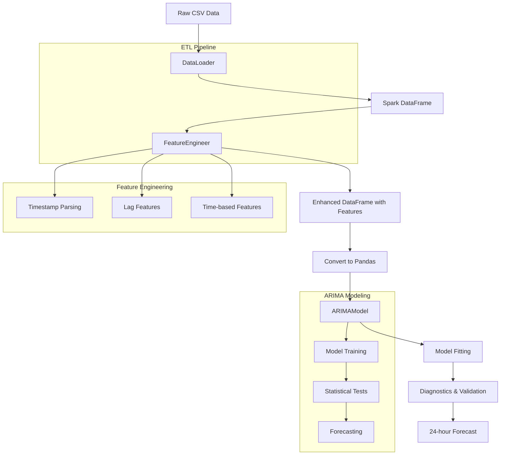

# Electricity Price Forecasting Pipeline for the Netherlands Market

A robust ETL and time series forecasting pipeline for predicting electricity spot prices using Apache Spark and ARIMA modeling.

## Overview

This project implements an end-to-end pipeline that processes electricity production and spot price data from the Netherlands energy market. The system uses Apache Spark for distributed data processing and ARIMA (AutoRegressive Integrated Moving Average) models for time series forecasting.

## Architecture



## Project Structure

```
├── src/
│   ├── etl/
│   │   ├── data_loader.py      # Raw CSV data ingestion
│   │   └── feature_engineer.py # Feature creation and transformation
│   ├── models/
│   │   └── arima_model.py      # ARIMA implementation
│   └── pipeline.py             # Main orchestration
├── utils/
│   └── session_utils.py        # Spark session management
├── data/
│   └── *.csv                   # Energy data files
└── main.py                     # Entry point
```

## Components

### 1. DataLoader (`data_loader.py`)

**Purpose**: Ingests raw CSV data and converts it to Spark DataFrame format.

**Key Features**:
- Skips the first 3 header rows
- Parses CSV lines into structured data
- Handles data validation and filtering
- Uses singleton Spark session for efficiency

**Data Schema**:
```python
Row(
    timestamp: str,      # ISO format timestamp
    nuclear: float,      # Nuclear energy production (MW)
    nonrenewable: float, # Non-renewable energy production (MW)
    renewable: float,    # Renewable energy production (MW)
    price: float         # Spot price (€/MWh)
)
```

### 2. FeatureEngineer (`feature_engineer.py`)

**Purpose**: Creates time-based and lag features for improved forecasting accuracy.

**Feature Engineering Steps**:

1. **Timestamp Parsing**: Converts string timestamps to proper datetime objects
   ```python
   timestamp = to_timestamp(col("timestamp"), "yyyy-MM-dd'T'HH:mmXXX")
   ```

2. **Lag Features**: Creates historical price features
   - `price_lag_1`: Price from 1 hour ago
   - `price_lag_2`: Price from 2 hours ago  
   - `price_lag_24`: Price from 24 hours ago (same hour previous day)

3. **Temporal Features**:
   - `hour_of_day`: Hour component (0-23)
   - `day_of_week`: Day of week (1=Sunday, 7=Saturday)

### 3. ARIMAModel (`arima_model.py`)

**Purpose**: Implements ARIMA time series forecasting with comprehensive diagnostics.

**Mathematical Foundation**:

The ARIMA(p,d,q) model combines three components:

**AutoRegressive (AR) Component**:
```
φ(B)Xt = (1 - φ₁B - φ₂B² - ... - φₚBᵖ)Xt
```

**Differencing (I) Component**:
```
∇ᵈXt = (1-B)ᵈXt
```

**Moving Average (MA) Component**:
```
θ(B)εt = (1 + θ₁B + θ₂B² + ... + θₑBᵠ)εt
```

**Complete ARIMA Model**:
```
φ(B)∇ᵈXt = c + θ(B)εt
```

Where:
- B = backshift operator
- φᵢ = autoregressive parameters
- θⱼ = moving average parameters
- εt = white noise error terms
- d = degree of differencing

**Default Configuration**: ARIMA(1,1,1)
- p=1: Uses 1 lagged observation
- d=1: First-order differencing for stationarity
- q=1: Uses 1 lagged forecast error

**Model Diagnostics**:

1. **Information Criteria**:
   - **AIC** (Akaike Information Criterion): `AIC = -2ln(L) + 2k`
   - **BIC** (Bayesian Information Criterion): `BIC = -2ln(L) + k*ln(n)`
   
   Where L = likelihood, k = parameters, n = observations

2. **Parameter Significance**:
   - Tests if AR and MA coefficients are statistically significant
   - Uses t-tests with null hypothesis: coefficient = 0

3. **Residual Analysis**:
   - **Ljung-Box Test**: Tests for autocorrelation in residuals
     ```
     LB = n(n+2)∑ᵢ₌₁ʰ[ρ²ᵢ/(n-i)]
     ```
   - **Jarque-Bera Test**: Tests for normality of residuals
     ```
     JB = n/6 * [S² + (K-3)²/4]
     ```
     Where S = skewness, K = kurtosis

### 4. Pipeline Orchestration (`pipeline.py`)

**Purpose**: Coordinates the entire forecasting workflow.

**Execution Flow**:
1. Load raw data using DataLoader
2. Apply feature engineering transformations
3. Convert Spark DataFrame to Pandas for ARIMA modeling
4. Fit ARIMA model and generate diagnostics
5. Produce 24-hour ahead forecasts

## Usage

### Prerequisites
```bash
pip install -r requirements.txt
```

### Running the Pipeline
```python
python main.py
```

### Expected Output

**Model Summary**:
- ARIMA coefficients and standard errors
- Statistical significance tests
- Model fit statistics

**Quality Metrics**:
```
Model Quality Metrics:
  AIC: 1234.56, BIC: 1245.67
  p-value AR(1): 0.001, MA(1): 0.023
  Ljung-Box p-value: 0.456
  Jarque-Bera p-value: 0.123
```

**24-Hour Forecast**:
- Point forecasts with confidence intervals
- Standard errors and prediction bounds

## Model Interpretation

### Good Model Indicators:
- **Low AIC/BIC**: Better model fit
- **Significant p-values** (< 0.05): AR/MA terms are meaningful
- **High Ljung-Box p-value** (> 0.05): No residual autocorrelation
- **High Jarque-Bera p-value** (> 0.05): Residuals are normally distributed

### Forecast Output:
- `mean`: Point forecast
- `mean_se`: Standard error of forecast
- `mean_ci_lower/upper`: Confidence interval bounds

## Data Requirements

Input CSV should contain:
- Timestamp in ISO format
- Nuclear energy production (MW)
- Non-renewable energy production (MW) 
- Renewable energy production (MW)
- Electricity spot price (€/MWh)

**Note**: First 3 rows are treated as headers and automatically skipped.

## Extending the Pipeline

### Adding New Features:
Modify `FeatureEngineer.transform()` to include additional temporal or engineering features.

### Alternative Models:
Replace `ARIMAModel` with other time series models (LSTM, Prophet, etc.) while maintaining the same interface.

### Distributed Processing:
For larger datasets, consider using Spark's `mapInPandas` for distributed ARIMA fitting across multiple time series.

## Performance Considerations

- **Spark Configuration**: Adjust partitioning based on data size
- **Memory Management**: Monitor driver memory for pandas conversion
- **Model Complexity**: Higher ARIMA orders increase computation time
- **Forecast Horizon**: Longer forecasts have higher uncertainty

## Contributing

When extending this pipeline:
1. Maintain the modular design pattern
2. Include comprehensive error handling
3. Add unit tests for new components  
4. Update documentation for new features